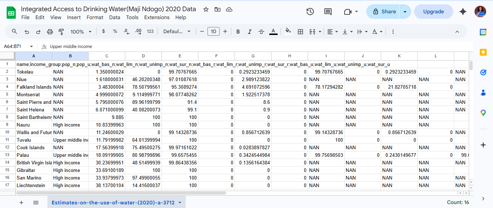
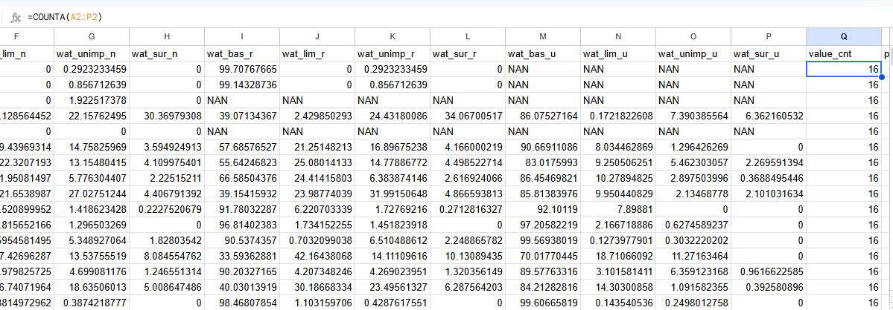
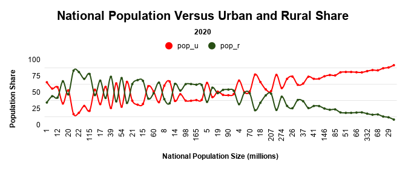
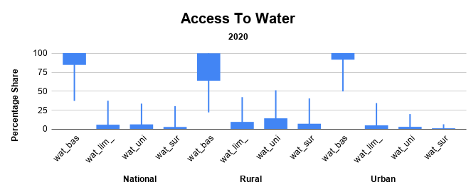
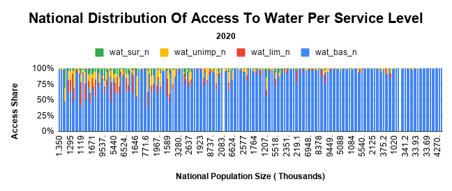
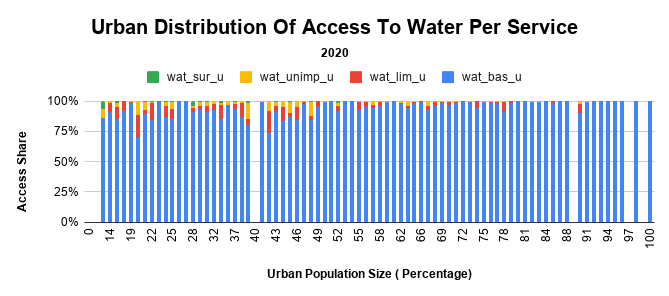
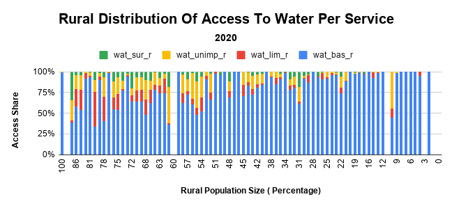
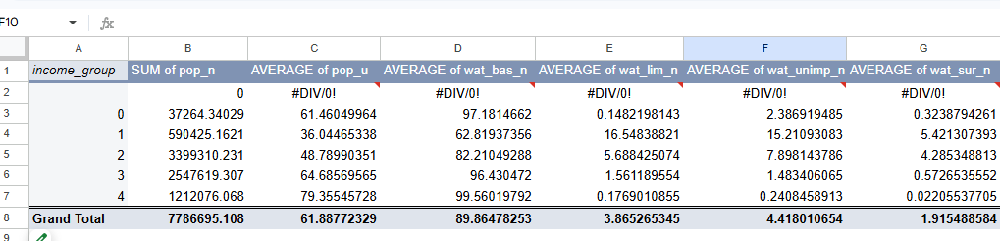

# Water_Distribution_google_sheet_project

## Overview
The Sustainable Development Goals (SDGs) are a global call to action to end poverty, ensure prosperity and peace for all people, and protect our planet.  
Goal 6 focuses on **Clean Water and Sanitation**: ensuring availability and sustainable management of water and sanitation for all.  

Due to climate change, droughts are becoming more prevalent and water supplies are decreasing worldwide. This affects access to drinking water, sanitation, and hygiene, often resulting in preventable diseases and deaths.  

This project investigates access to safe and affordable drinking water, focusing on inequalities in service levels between countries, regions, and income groups.

---

## 1. Understanding the Dataset
We used the WHO/UNICEF JMP (Joint Monitoring Programme for Water Supply, Sanitation, and Hygiene) dataset for 2020.  

### Features
- **name**: Country or area name  
- **income_group**: Country’s classification by income group  
- **pop_n**: National population size estimate (in thousands)  
- **pop_u**: Urban population share (%)  
- **_wat_bas_n_**: National share with at least basic service (%)  
- **_wat_lim_n_**: National share with limited service (%)  
- **_wat_unimp_n_**: National share with unimproved service (%)  
- **_wat_sur_n_**: National share with surface service (%)  
- **_wat_bas_r_**, **_wat_lim_r_**, **_wat_unimp_r_**, **_wat_sur_r_**: Rural shares  
- **_wat_bas_u_**, **_wat_lim_u_**, **_wat_unimp_u_**, **_wat_sur_u_**: Urban shares  



---

## 2. Importing the Data
- Encountered semicolon separators instead of commas.  
- Used **Data > Split text to columns** to fix headers and values.  
- Created a validation feature `value_cnt` using `COUNTA()` to ensure each row had 16 values.  
- Filtered and corrected 5 rows with errors.  
- Confirmed all rows were properly structured for analysis.



---

## 3. Investigating Population Size
- World population in 2020: **7.821 billion**, with **55% urban**.  
- Created a **Global 2020 Report** sheet to compare dataset totals with world estimates.  
- Added new feature `pop_u_val` = `pop_n × (pop_u / 100)` to calculate urban population per country.  
- Compared dataset totals to world estimates using percentage difference formula:  


\[
  \text{Percentage Difference} = \frac{|V_2 - V_1|}{\frac{V_1 + V_2}{2}} \times 100
\]


- Created a line chart of national population vs urban/rural shares.  
- Adjusted x-axis to millions (`pop_n (m)`) to improve readability.  
- Observed that urbanization strongly influences access disparities.



---

## 4. Investigating Access by Area
- Calculated max/min values for national service levels.  
- Corrected `_wat_bas_n_` values exceeding 100% by rounding.  
- Calculated mean, median, mode, IQR, and standard deviation for all service levels.  
- Created **box and whisker plots (candlestick charts)** for 12 features (national, rural, urban).  
- Found that national access to basic services is generally high, but rural areas show greater reliance on limited/unimproved services.



---

## 5. Investigating Access by Population Size
- Created **100% stacked column charts** for national, urban, and rural access levels.  
- Adjusted population size to millions (`pop_n (m)`) for clarity.  
- Created new features `pop_u (rounded)` and `pop_r (rounded)` for urban and rural shares.  
- Ordered datasets to ensure x-axis alignment.  
- Insights:  
  - Urban populations generally have better access to basic services.  
  - Rural populations face higher levels of limited/unimproved services.  
  - Area type (urban vs rural) is a stronger determinant of inequality than population size alone.

  
  


---

## 6. Investigating Access by Income Group
- Grouped dataset by **income_group** using a pivot table.  
- Values:  
  - Sum of population size (`pop_n`)  
  - Average urban share (`pop_u`)  
  - Average national shares of basic, limited, unimproved, and surface services  
- Converted `income_group` to numeric values for sorting:  
  - NAN = 0  
  - Low income = 1  
  - Lower middle income = 2  
  - Upper middle income = 3  
  - High income = 4  
- Visualized disparities across income groups.  
- Findings:  
  - High-income countries show higher access to basic services.  
  - Low-income countries rely more on limited, unimproved, and surface services.  
  - Urbanization amplifies these differences.



---

## Results
- **National level**: Most countries show high basic service access, but disparities remain.  
- **Urban vs Rural**: Urban areas consistently outperform rural areas in access to safe water.  
- **Population size**: Large populations skew visualizations, but area type is more influential.  
- **Income group**: Strong correlation between wealth and access to safe water services.  

---

## Tools & Technologies
- **Google Sheets**: Data import, cleaning, analysis, and visualization.  
- **Pivot Tables**: Summarizing by income group.  
- **Charts**: Line charts, stacked column charts, and box & whisker plots.  
- **Basic Functions**: `COUNTA()`, `ABS()`, rounding, filters.  

---

## Project Learnings
- Importance of **data cleaning** (handling separators, fixing errors).  
- How to use **measures of central tendency and spread** to understand distributions.  
- Visualization techniques to make large datasets more comprehensible.  
- Clear disparities in water access by **area type** and **income group**.  
- Reinforced the link between **urbanization, wealth, and access to safe water**.  

---

## Author
**Blessing-Chinaza**  

Connect with me on [LinkedIn](https://www.linkedin.com/in/blessing-nwokike/)  

---

## How to Use
1. Clone the repository:
   ```bash
   git clone https://github.com/Blessing-Chinaza/Water_Distribution_google_sheet_project.git

